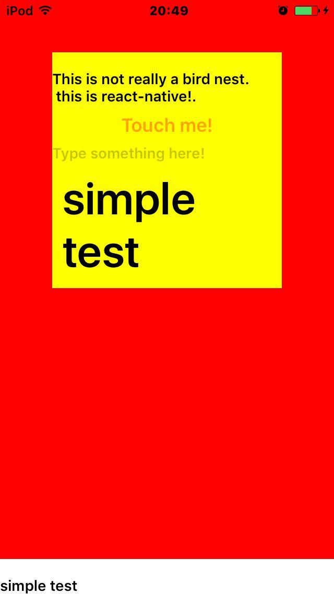
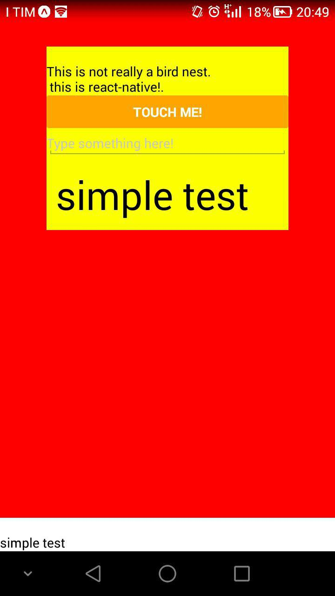

# React-Native

I create this repo to save my progress with react-native app.
React-native allows to implement an app in two different platform (Android/IOS), so you write code one but you have your app that runs in two different
system.

# Getting Started

Read the following guide https://facebook.github.io/react-native/docs/getting-started.html ,to getting started with react-native.

# Running the tests

	

	  
	    
		IOS view	
	   
	
	 
		IOS view	
	   
	

	

	   Android view 
	

